# Contributor Architecture and Data Flow

This guide is for new contributors, especially contributors working through coding agents. It explains how the repository is arranged, where data moves at runtime, and which files an agent should inspect before changing behavior.

If you need a shorter overview first, read [Architecture Overview](./architecture.md). If you need a full source inventory, read [File System Map](./FILE-SYSTEM-MAP.md). If you are changing workflow state or persistence, keep [Database Map](../db-map.md) open too.

## Naming Note

The product is packaged as `gwd-pi` and exposes the `gwd` CLI. Current user and contributor docs should use GWD names, `/gwd` commands, `.gwd/` project state, and `GWD_*` environment variables.

One path detail matters: the current path contract resolves the workflow database to `.gwd/gwd.db` through `resolveGwdPathContract()` in `src/resources/extensions/gwd/paths.ts`. Trust the path contract and tests when docs, comments, or older plans disagree.

## Mental Model

GWD is a TypeScript monorepo that wraps a vendored Pi coding-agent runtime with GWD-specific workflow orchestration. The CLI starts the Pi runtime, loads bundled GWD extensions and tools, then runs one of several surfaces: terminal UI, print mode, headless RPC, MCP, or the web UI.

There are two important persistence streams:

- Conversation sessions are stored under `~/.gwd/sessions/` by `SessionManager`.
- Project workflow state is stored in `.gwd/gwd.db`; markdown files under `.gwd/` are human-readable projections and recovery artifacts.

For agent contributors, the safe default is: read state through exported helpers, write workflow state through registered GWD tools or `gwd-db.ts` wrappers, and avoid direct SQL or direct edits to generated `.gwd/` files.

## Repository Layers

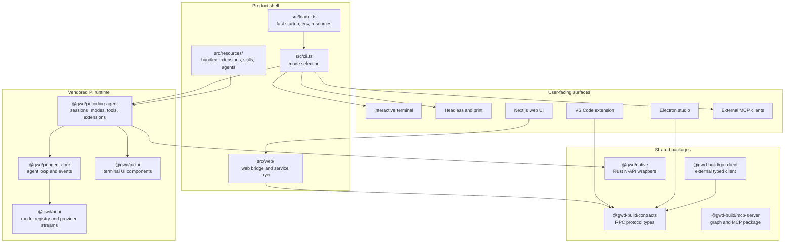

### Main Directories

| Path | Role | Start Here When |
|---|---|---|
| `src/loader.ts` | CLI bootstrap before heavy imports | startup, env, resource sync, install diagnostics |
| `src/cli.ts` | Top-level mode router | command behavior, onboarding, mode selection |
| `packages/pi-coding-agent/src/core/` | Session wrapper, tools, extension system | agent sessions, tools, compaction, persistence |
| `packages/pi-agent-core/src/` | Provider-agnostic agent loop | LLM turn behavior, tool-call loop, events |
| `packages/pi-ai/src/` | Provider adapters and streaming | model/provider support, API payloads |
| `src/resources/extensions/gwd/` | GWD workflow engine | auto mode, DB state, commands, workflow tools |
| `src/web/` | Server-side web bridge services | browser to RPC process flow |
| `web/` | Next.js frontend | browser UI, live state, terminal panes |
| `packages/contracts/` | Shared RPC contracts | changing RPC command/event shapes |
| `native/`, `packages/native/` | Rust engine and TS wrappers | search, glob, git, text, image, process performance paths |
| `vscode-extension/` | VS Code integration | chat participant, sidebar, RPC integration |

## Runtime Entry Points

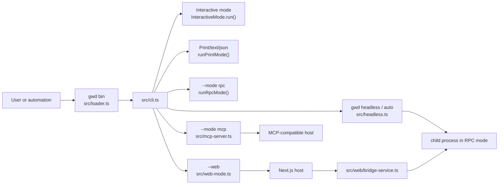

### Mode Ownership

| Mode | Entry Path | What It Owns |
|---|---|---|
| Interactive | `src/cli.ts` -> `InteractiveMode` | TUI rendering, keyboard flow, extension UI bindings |
| Print | `src/cli.ts` -> `runPrintMode()` | one-shot prompt execution without TTY |
| RPC | `src/cli.ts` -> `runRpcMode()` | JSONL command/event protocol over stdin/stdout |
| Headless | `src/headless.ts` | orchestration around an RPC child, answer injection, timeout/restart policy |
| MCP | `src/mcp-server.ts` | exposes all active GWD tools to MCP clients |
| Web | `src/web-mode.ts`, `web/`, `src/web/bridge-service.ts` | browser host, per-project bridge, live state, embedded remote terminal |

## Startup Flow

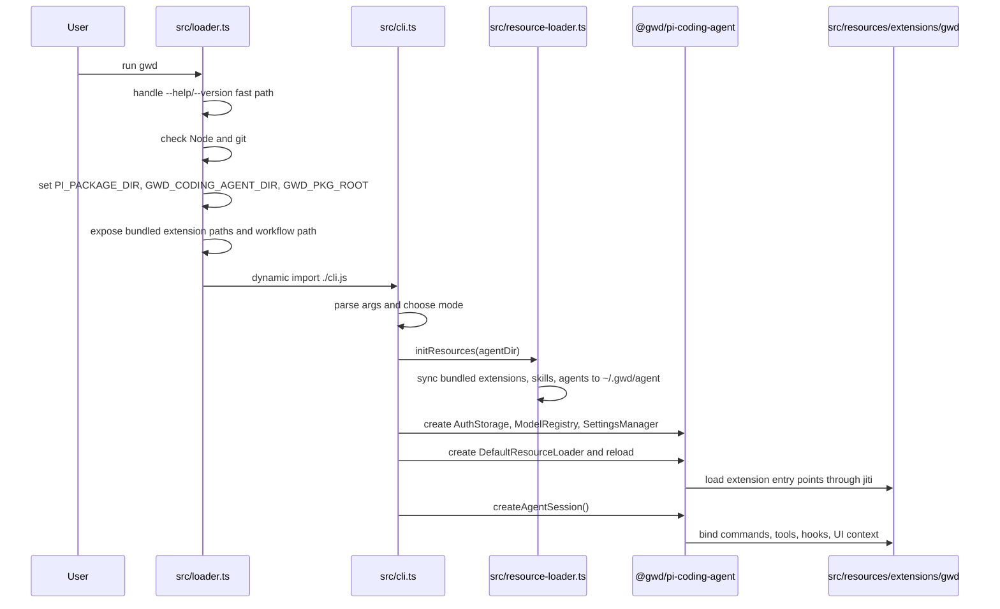

Key details:

- `src/loader.ts` intentionally sets environment variables before importing the Pi SDK. This prevents configuration from being read too early.
- `src/resource-loader.ts` syncs bundled resources into `~/.gwd/agent/` so installed or updated resources are used consistently.
- `packages/pi-coding-agent/src/core/resource-loader.ts` then loads extensions, skills, prompt templates, themes, and project context files.
- `src/resources/extensions/gwd/index.ts` registers the core `/gwd` command first, then bootstraps tools and hooks through `bootstrap/register-extension.ts`.

## Agent Turn Data Flow

```mermaid
sequenceDiagram
  participant UI as Mode UI or RPC command
  participant Session as AgentSession
  participant Ext as ExtensionRunner
  participant Agent as Pi Agent
  participant Loop as agent-loop.ts
  participant Provider as pi-ai provider
  participant Tool as Tool executor
  participant Store as SessionManager

  UI->>Session: prompt(text, images)
  Session->>Ext: input hook
  Session->>Session: expand /skill and prompt templates
  Session->>Ext: before_agent_start hook
  Session->>Agent: prompt(AgentMessage[])
  Agent->>Loop: start turn
  Loop->>Ext: transformContext and adjust_tool_set hooks
  Loop->>Provider: streamSimple(model, context, tools)
  Provider-->>Loop: text, thinking, tool calls, done
  Loop->>Tool: validate and execute tool calls
  Tool-->>Loop: tool result messages
  Loop-->>Agent: agent events
  Agent-->>Session: message_start/update/end, tool_execution, agent_end
  Session->>Ext: event and tool hooks
  Session->>Store: append messages, model changes, thinking changes
  Session->>Session: retry or compact when needed
  Session-->>UI: streamed events
```

Detailed path:

1. A mode calls `AgentSession.prompt()` in `packages/pi-coding-agent/src/core/agent-session.ts`.
2. Extension `input` hooks can handle or transform the message.
3. Skill commands and prompt templates are expanded unless explicitly disabled.
4. `before_agent_start` hooks can inject custom messages or adjust the system prompt for the turn.
5. `Agent.prompt()` enters `packages/pi-agent-core/src/agent-loop.ts`.
6. The loop converts internal `AgentMessage[]` into provider `Message[]` only at the LLM boundary.
7. `packages/pi-ai/src/stream.ts` dispatches to the provider registered for the selected model API.
8. Assistant stream events are emitted as session events.
9. Tool calls are validated, passed through extension tool hooks, executed, and returned as tool-result messages.
10. `AgentSession` persists messages through `SessionManager`, emits extension events, and runs retry or compaction checks after `agent_end`.

## Tool and Extension Flow

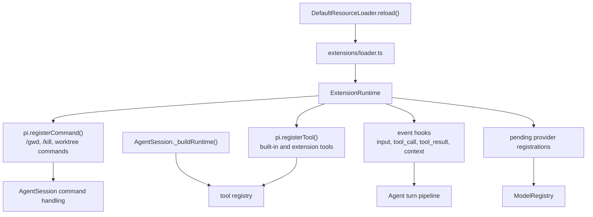

The GWD extension registers several classes of tools:

- Dynamic filesystem/shell wrappers in `bootstrap/dynamic-tools.ts`, which resolve the active workspace root at execution time.
- DB-backed workflow tools in `bootstrap/db-tools.ts`, which call typed writers and regenerate projections.
- Exec, journal, memory, and query tools in their matching `bootstrap/*-tools.ts` files.
- Ecosystem extensions loaded by `ecosystem/loader.ts`.

When adding a tool, decide where it belongs:

- Generic coding tool: `packages/pi-coding-agent/src/core/tools/`.
- GWD workflow tool: `src/resources/extensions/gwd/bootstrap/*-tools.ts`.
- External/public protocol shape: also update `packages/contracts/` or MCP adapters if applicable.

## Workflow State Data Flow

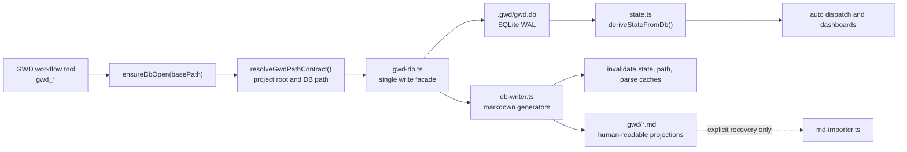

Important invariants:

- Runtime state is DB-first. `deriveState()` reads the database whenever it is available.
- Markdown fallback is explicit-only through `GWD_ALLOW_MARKDOWN_DERIVE_FALLBACK=1` or recovery flows.
- `gwd-db.ts` is the write facade. Do not add ad hoc `INSERT`, `UPDATE`, or `DELETE` calls outside its wrappers.
- `db-writer.ts` regenerates `DECISIONS.md`, `REQUIREMENTS.md`, and artifact projections after DB writes.
- Projection writes are best effort for some paths. A failed projection write should not roll back an already committed DB write unless the caller explicitly requires it.
- Worktree execution still converges on the project-root `.gwd/gwd.db`; worktree-local `.gwd/` content is compatibility/projection state.

### DB Write Example

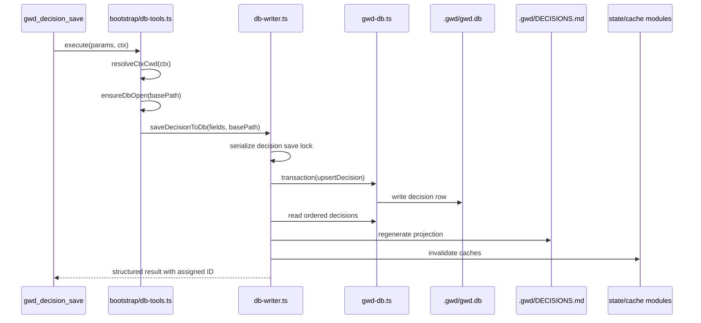

## Auto Mode Data Flow

Auto mode is the autonomous execution loop owned by `src/resources/extensions/gwd/auto*` and `src/resources/extensions/gwd/auto/`.

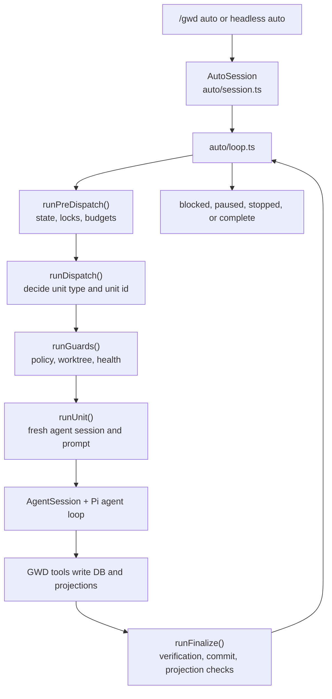

The loop is easiest to follow from these files:

- `auto/loop.ts`: top-level iteration and recovery decisions.
- `auto/phases.ts`: named phase boundaries used by the loop.
- `auto/run-unit.ts`: creates a fresh session, sends the unit prompt, and waits for `agent_end`.
- `auto-dispatch.ts`: maps derived state to the next unit.
- `auto-prompts.ts`: builds prompts and inline context for units.
- `auto-post-unit.ts`: post-unit verification, git, projections, hooks, and closeout.
- `auto-worktree.ts` and `worktree-state-projection.ts`: worktree lifecycle and final projection.
- `db/unit-dispatches.ts`, `db/milestone-leases.ts`, `db/auto-workers.ts`, `db/runtime-kv.ts`: DB-backed coordination state.

Agent contributors should not treat auto mode as "the LLM looping on itself." The TypeScript loop decides the next unit, builds bounded context, starts a fresh session, supervises completion, writes durable state, and only then advances.

## Web and RPC Data Flow

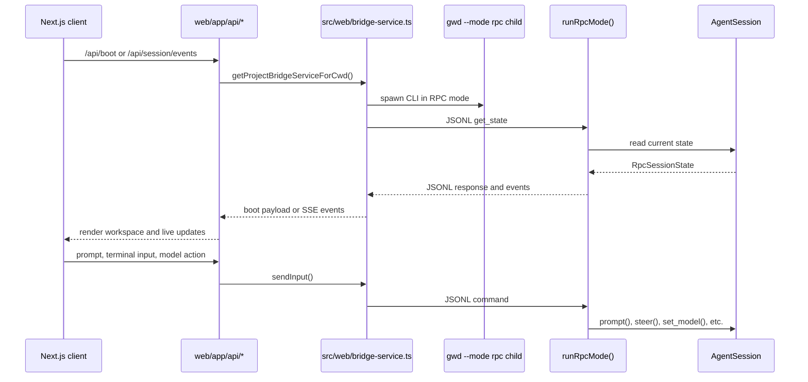

Key contracts:

- `packages/contracts/src/rpc.ts` is the shared protocol definition.
- `packages/pi-coding-agent/src/modes/rpc/rpc-mode.ts` implements the runtime server side.
- `packages/pi-coding-agent/src/modes/rpc/rpc-client.ts` is the internal client used by headless mode.
- `packages/rpc-client/src/rpc-client.ts` is the standalone external SDK client.
- `src/web/bridge-service.ts` manages one bridge per project, process lifecycle, JSONL requests, response timeouts, live-state invalidation, and embedded terminal output.
- `web/app/api/session/events/route.ts` streams bridge events to the frontend through SSE.

When changing RPC behavior, update contracts first, then both runtime adapters and tests. If the web UI consumes the shape, update `web/lib/*` types too.

## MCP Data Flow

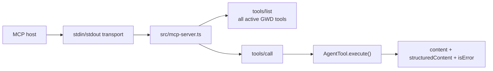

`src/cli.ts` starts MCP mode after creating an agent session. It activates all registered tools before starting `startMcpServer()`, because an MCP host expects extension tools as well as built-in tools. The server maps GWD tool `details` into MCP `structuredContent`.

## Native Engine Flow

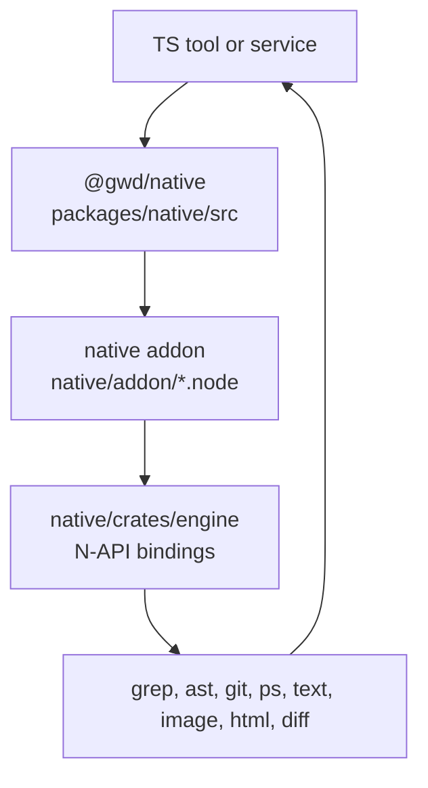

Use native modules for performance-sensitive operations that already have wrappers. Do not reimplement large file search, globbing, syntax highlighting, process tree handling, or image processing in TypeScript unless the existing native wrapper is missing the needed behavior.

## Build and Test Flow

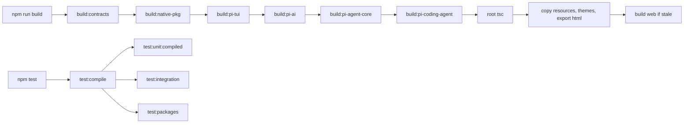

Common checks:

- `npm run build:core`: package and root TypeScript build without the web stale-build wrapper.
- `npm run typecheck:extensions`: extension TypeScript contracts.
- `npm run test:unit`: compiled unit suite.
- `npm run test:integration`: integration tests under `src/tests/integration` and extension integration tests.
- `npm run verify:pr`: main local pre-PR gate.

## Common Change Paths

| Task | Inspect First | Likely Tests |
|---|---|---|
| Add a CLI subcommand | `src/cli.ts`, `src/help-text.ts`, command-specific modules | parser/help tests, subcommand tests |
| Change startup behavior | `src/loader.ts`, `src/cli.ts`, `src/runtime-checks.ts` | startup, runtime, package smoke tests |
| Add or change a built-in coding tool | `packages/pi-coding-agent/src/core/tools/` | tool unit tests and agent-session tool tests |
| Add a GWD workflow tool | `src/resources/extensions/gwd/bootstrap/*-tools.ts`, `tools/workflow-tool-executors.ts` | extension/tool tests and DB writer tests |
| Change workflow state | `gwd-db.ts`, `db-writer.ts`, `state.ts`, `docs/db-map.md` | DB migration, state derivation, projection tests |
| Change auto-mode dispatch | `auto/loop.ts`, `auto-dispatch.ts`, `auto-prompts.ts`, `auto-post-unit.ts` | auto loop, dispatch, recovery, integration tests |
| Change web UI command behavior | `web/app/api/*`, `src/web/bridge-service.ts`, `packages/contracts/src/rpc.ts` | web integration and bridge contract tests |
| Change provider/model behavior | `packages/pi-ai/src/`, `packages/pi-coding-agent/src/core/model-*`, `src/models-resolver.ts` | provider/model registry tests |
| Change resource or extension loading | `src/resource-loader.ts`, `packages/pi-coding-agent/src/core/resource-loader.ts`, `extensions/loader.ts` | extension discovery/load/perf tests |
| Change worktree behavior | `src/worktree-cli.ts`, `src/resources/extensions/gwd/auto-worktree.ts`, `worktree-state-projection.ts` | worktree CLI, projection, auto integration tests |

## Agent Contributor Checklist

Before editing:

1. Read the target module and nearby tests.
2. Check [File System Map](./FILE-SYSTEM-MAP.md) for ownership labels.
3. If `.gwd/` state is involved, read [Database Map](../db-map.md) and inspect `gwd-db.ts`.
4. Use `rg` to find all call sites and contract tests.

While editing:

1. Prefer existing helpers and typed wrappers over direct file or SQL writes.
2. Keep explicit workspace roots flowing through the code; avoid relying on ambient `process.cwd()` in workflow logic.
3. Preserve the DB-first model. Markdown projections are for humans, prompts, history, and recovery.
4. If you change an RPC or tool result shape, update contracts, adapters, renderers, and tests together.
5. If you change startup or resource loading, consider source-dev, packaged install, Windows, and web-host paths.

Before handing off:

1. Run the narrow tests for the area you changed.
2. Run typecheck or build if public types, package exports, or generated resources changed.
3. Update this guide when you add a new architectural boundary, state store, runtime mode, or data-flow contract.
